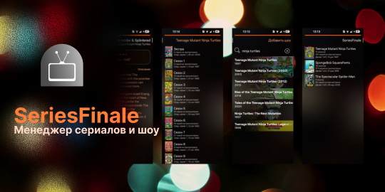

# SeriesFinale для ОС Аврора

SeriesFinale - менеджер просмотренных шоу и сериалов на основе API сервиса [TheTVDB](http://www.thetvdb.com).

| Ссылки для скачивания |
| --- |
| 📦 [RuStore для ОС Аврора](https://www.rustore.ru/osaurora) <br> 🛒 [Аврора Маркет](https://aurorarepos.ru/appitem/seriesfinale) <br> 😼 [Скачать RPM](https://github.com/Smooth-E/aurora-seriesfinale/releases/latest/) |

## Сборка

Рекомендуется использовать Aurora SDK MB2 Tools на Linux или внутри WSL. На других конфигурациях возможность сборки проекта не проверяется, но вы всегда можете предложить необходимые исправления для работы в вашем окружении.

1. Клонируйте этот репозиторий:
   ```sh
   git clone --recurse-submodules https://github.com/Smooth-E/aurora-seriesfinale
   ```
2. Примените необходимые патчи:
   ```sh
   git apply libs/*.patch
   ```
3. Соберите cpython и pyotherside. Это достаточно сделать один раз для каждой архитектуры.
   ```sh
   aurora_psdk ./prepare.sh -t AuroraOS-5.1.5.105-MB2-aarch64
   ```
4. При сборке пакета используйте так называемый shadow build, то есть сборку в отдельной папке:
   ```sh
   mkdir -p build && cd build
   aurora_psdk mb2 -t AuroraOS-5.1.5.105-MB2-aarch64 -x build ../
   ```

О подписи и установке пакетов на устройство можно почитать в [документации](https://developer.auroraos.ru/doc/sdk).

## Авторы

Это порт приложения для ОС Аврора, основанный на порте для Sailfish OS, который, в свою очередь, построен на основе оригинального приложения для системы Maemo.

- Порт приложения для ОС Аврора: https://github.com/Smooth-E/aurora-seriesfinale
  <br/>Поддерживается [Smooth-E](https://github.com/Smooth-E)
- Приложения для Sailfish OS: https://github.com/joaquimrocha/SeriesFinale
  <br/>Поддерживается [ichthyosaurus](https://github.com/ichthyosaurus)
- Приложение для Maemo: https://github.com/joaquimrocha/SeriesFinale
  <br/>Разработано Joaquim Rocha и Juan A. Suarez 

Локализация:
- Немецкий: [@corecomic](https://github.com/corecomic/) и [@ichthyosaurus](https://github.com/ichthyosaurus)
- Испанский: [@carmenfdezb](https://github.com/carmenfdezb)
- Шведский: [@eson57](https://github.com/eson57)
- Русский: [@smooth-e](https://github.com/smooth-e)

**Примечание:** на ОС Аврора доступны только языки Русский и Английский.

Автор обоев для атмосферы на скриншотах приложения: [@liia8 на Unsplash](https://unsplash.com/photos/a-blurry-photo-of-a-bunch-of-lights-8lJVuknQvo0)

## Лицензирование

SeriesFinale **не является** официальным продуктом TheTVDB. Данный проект - работа волонтеров. Не стесняйтесь предлагать свои изменения и улучшения, а также сообщать о проблемах.

SeriesFinale распространяется под лицензией [GPLv3.0 или новее](https://spdx.org/licenses/GPL-3.0-or-later.html). Разработчики не предоставляют никаких гарантий и не несут ответственности за ущерб.
